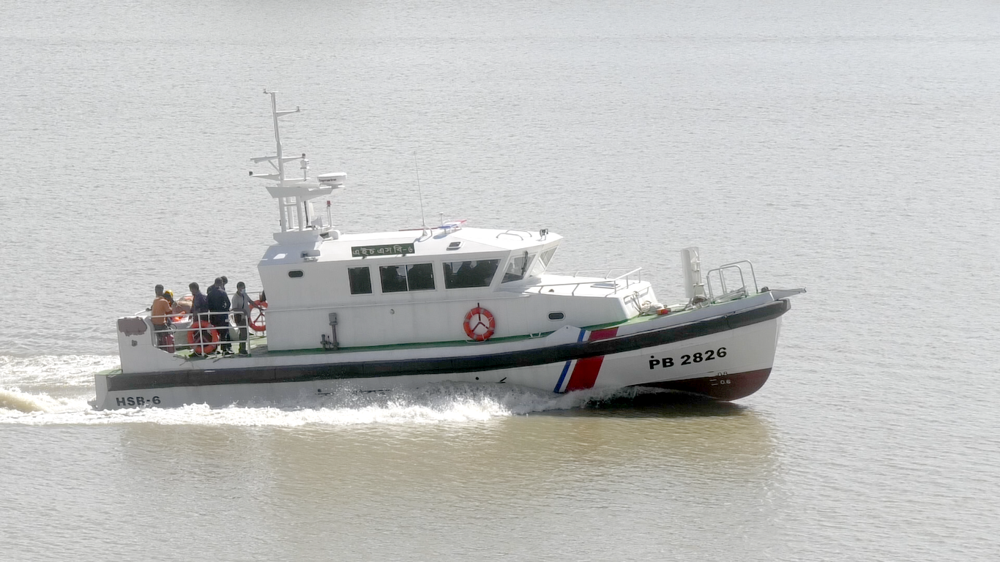

# 🚤 High-Speed Patrol Boat (HSPB)

  

<h2 align="center">06 × High-Speed Patrol Boat (HSPB)</h2>

<b>Bangladesh Coast Guard (BCG)</b> 
Project Coordinator | Naval Architect | Structural Detailed Design | Stability Analysis | Class Compliance

---

## 📌 Project Summary

Successfully delivered **06 High-Speed Patrol Boats** for the **Bangladesh Coast Guard** to strengthen maritime security, law enforcement, and search and rescue capabilities. The vessels feature a **deep-V hard chine hull form** optimized for high-speed performance, superior seakeeping, and offshore operations in challenging sea conditions.

Designed for continuous operation in **Sea State 4/5**, the boats support **anti-piracy, anti-smuggling, anti-drug trafficking, search and rescue, fisheries protection, disaster relief, Sundarbans patrol, and maritime surveillance** missions.

As **Project Coordinator and Naval Architect**, I was responsible for engineering coordination, structural detailed design, hydrostatic and stability analysis, design review, construction support, and technical compliance throughout the project lifecycle.

| **Client** | Bangladesh Coast Guard (BCG) |
|:-----------|:-----------------------------|
| **Vessel Type** | High-Speed Patrol Boat |
| **Quantity** | 06 Boats |
| **Role** | Project Coordinator & Naval Architect |
| **Scope** | Structural Detailed Design • Stability Analysis • Engineering Coordination • Construction Support |
| **Delivery** | 2021 |

---

## 📐 Principal Particulars

| Parameter | Value |
|:----------|------:|
| Hull Type | **Deep-V Hard Chine** |
| Length Overall (LOA) | **15.4 m** |
| Breadth | **4.5 m** |
| Maximum Draft | **1.1 m** |
| Full Load Displacement | **15.1 tonnes** |
| Standard Displacement | **14.0 tonnes** |
| Light Displacement | **11.55 tonnes** |
| Operational Capability | **Up to Sea State 5** |

---

## 👨‍💼 Engineering Contributions

- Coordinated engineering, production, procurement, and construction activities throughout the project.
- Prepared and reviewed **structural detailed drawings** in accordance with project specifications and applicable classification requirements.
- Performed **hydrostatic calculations, stability analysis, weight estimation, and loading condition assessments** to ensure operational safety and compliance.
- Reviewed hull structure, machinery foundation, outfitting, and production documentation for technical accuracy.
- Coordinated multidisciplinary engineering activities between designers, production teams, client representatives, and equipment suppliers.
- Supported construction by resolving technical issues, managing design revisions, and ensuring production quality.
- Participated in inspections, harbour acceptance tests, sea trials, commissioning, and successful delivery of all six vessels.
- Ensured compliance with contractual requirements, quality standards, and project schedules.

---

## ⭐ Operational Capabilities

- Anti-Piracy Operations
- Anti-Smuggling & Anti-Drug Trafficking
- Search & Rescue (SAR)
- Fisheries Protection
- Coastal & Offshore Patrol
- Sundarbans Patrol
- Maritime Surveillance
- Disaster Relief Operations

---

## ⭐ Technical Expertise Demonstrated

**High-Speed Craft Design • Structural Detailed Design • Hydrostatics & Stability • Weight Control • Structural Engineering • Engineering Coordination • Design Review • Production Engineering • Construction Support • Technical Documentation • Project Management • Quality Assurance • Commissioning**

---

## 💻 Engineering Software

**AVEVA Marine • AutoCAD • Maxsurf (Hydrostatics & Stability) • Rhino3D • ANSYS • FastNEST**

---

## 📬 Contact

**Md. Ariful Islam**

**Senior Naval Architect | Ship Design | Structural Engineering | Stability Analysis | Project Management | Classification Compliance**

📧 **ariful.buet1985@gmail.com**

💼 **https://linkedin.com/in/islam-mdariful**

---

<b>Delivering Safe, High-Performance, and Mission-Ready Maritime Engineering Solutions.</b>

